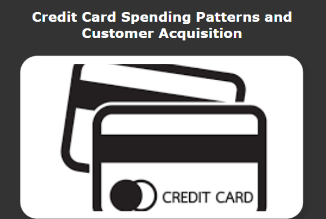
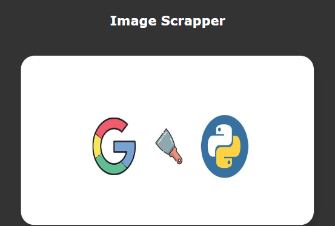
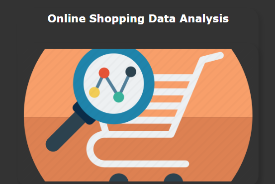
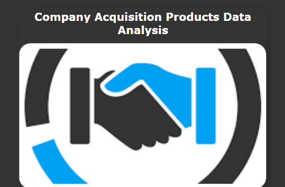

<!DOCTYPE html>
<html>
<head>
	<meta charset="utf-8">
	<meta name="viewport" content="width=device-width, initial-scale=1">
	<title>Personal Portfoliyo</title>
	<link rel="stylesheet" href="https://cdnjs.cloudflare.com/ajax/libs/font-awesome/6.4.2/css/all.min.css">
	<link rel="stylesheet" type="text/css" href="./CSS/style.css">
</head>
<body>

	

	<header>

		

			
			<h3 class="name">Radha Jangid</h3>
			
Data Analyst

		

		<nav class="navbar">
			<a href="#Home">Home</a>
			<a href="#About">About</a>
			<a href="#Skills">Skills</a>
			<a href="#Projects">Projects</a>
			<a href="#Contact">Contact</a>
			
		</nav>
		

			
			
			
			
		

	</header>

	<section class="Home" id="Home">
		<h3>Hi... </h3>
		<h1>My name is Radha Jangid</h1>
		
I am Seeking for the position of Data Analyst where I can efficiently contribute my skills and abilities!

		<a href="#"download><button class="btn">Resume<i class="fas fa-download"></i></button></a>    
	</section>

	<section class="About" id="About">
		<h1 class="heading">about me </h1>
		

		

			

				

					
				

				

					<h3></h3>
					
Analytically minded entry-level data analyst with a strong background in data 		manipulation  and reporting. 
						Proficient in SǪL, Excel, and Python, adept at creating dashboards and visualizations to present key findings. 
						Motivated to leverage data-driven insights to optimize processes and enhance decision- making.

					

						
Hobbies

						
Language

						
Interest

					

					
 
				
						<ul>
							<li>Reading spritual books</li>
							<li>Listening speritual music</li>
						</ul>
					

					

						<ul>
							<li>English</li>
							<li>Hindi</li>
							<li>Marwari</li>
						</ul>
					

					

						<ul>
							<li>AI/ML</li>
							<li>Data Science</li>
						</ul>
					

					
				

				
			

		

	

	</section>
	<section class="Skills" id="Skills">
		<h1 class="heading"> my Skills</h1>
		

			

				<abbr title="Python">
					</abbr>
			

			

				<abbr title="SQL">
					
				</abbr>
			

			

				<abbr title="PowerBI">
					</abbr>
			

			

				<abbr title="Tableau">
					</abbr>
			

			

				<abbr title="MySQL">
					</abbr>
			

			

				<abbr title="Excel">
					</abbr>
			

			

				<abbr title="MongoDB">
					</abbr>
			

			

				<abbr title="Data_Modeling">
					</abbr>
			

			

				<abbr title="Data_Preparation">
					</abbr>
			

			

				<abbr title="ML">
					</abbr>
			

			

				<abbr title="Statistics">
					</abbr>
			

			

				<abbr title="DAX">
					
					</abbr>
			

		
			

				<abbr title="Seaborn">
					</abbr>
			

			

				<abbr title="	Matplotlib">
					</abbr>
			

			

				<abbr title="Pandas">
					</abbr>
			

			
		

	</section>
		
		
		
	<section class="Education" id="Education">
		<h1 class="heading"> my education</h1>
		

			

				<i class="fas fa-graduation-cap"> </i>
				2023
				<h3>MCA</h3>
				
Banaras Hindu University Varanasi, Uttar Pradesh

	            
Master of Computer Applications 2021 – 2023

				
			

			

				<i class="fas fa-graduation-cap"> </i>
				2020
				<h3>BCA</h3>
				
G.D. Memorial College Jodhpur, Rajasthan

	            
Bachelor of Computer Applications 2017 – 2020

				
			

			

				<i class="fas fa-graduation-cap"> </i>
				2017
				<h3>HSC : PCM</h3>
				
Agarwal Jamna Devi Girls SEN. SEC School Jodhpur, Rajasthan

	            
Higher Secondary Certificate

	            
RBSE – 2017

				
			

			

				<i class="fas fa-graduation-cap"> </i>
				2015
				<h3>SSC</h3>
				
K.R. Public SEN. SEC School Jodhpur, Rajasthan

	            
Secondary School Certificate 

	            
RBSE – 2015

			

		

	</section>
	<section class="Projects" id="Projects">
		<h1 class="heading"> my personal projects</h1>
		

			

				
			

			

				
			

			

				
			

			

				
			

			
		

	</section>

	<section class="Contact" id="Contact">
		<h1 class="heading"> contact  me </h1>
		

			

				<h3 class="title">contact info</h3>
				

					<h3><i class="fas fa-envelope"></i>jangidradha1299@gamil.com</h3>

					<h3><i class="fas fa-phone"></i>+91-9588847950</h3>

					<h3><i class="fas fa-map-marker-alt"></i>jodhpur, rajasthan, india - 342001.</h3>
					
				

				
			

			<form action="" name="submit-to-google-sheet">
				<input type="text" name="Name" placeholder="name" class="box">
				<input type="email" name="Email" placeholder="email" class="box">
				<textarea name="Message" id="" cols="30" rows="10" class="box message" placeholder="message"></textarea>
				<button type="submit" class="btn"> send <i class="fas fa-paper-plane"></i></button>
			</form>
			
		

	</section>

</body>
</html>
